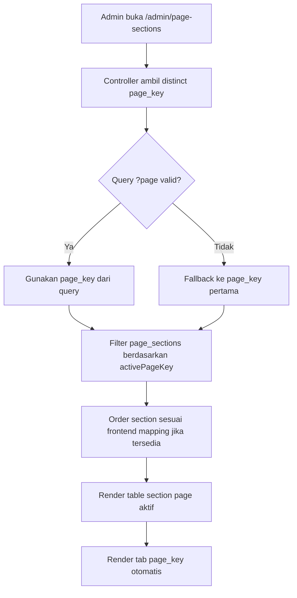

# Page Sections Page Management - Step 1

Branch: `feature/page-sections-page-management`

## Tujuan Step 1

Merapikan halaman admin `Page Sections` agar section tidak bercampur ketika nanti ada banyak page.

Step ini hanya menambahkan filter/tab berdasarkan `page_key`.

Step ini belum membuat page builder penuh dan belum menambah table baru.

## Scope

Yang dikerjakan:

```text
Admin Page Sections membaca daftar page_key dari database.
Admin menampilkan tab/filter per page_key.
Table Page Sections hanya menampilkan section dari page aktif.
Default page aktif adalah page_key pertama yang tersedia.
Pagination tetap membawa query page aktif.
Urutan section di dalam page tetap mengikuti frontend mapping jika tersedia.
```

Yang belum dikerjakan di step ini:

```text
Belum membuat table pages.
Belum membuat create page.
Belum membuat add/remove/reorder section.
Belum membuat registry generic baru.
Belum membuat dynamic frontend custom page route.
```

## Data Source

Daftar page tab diambil dari:

```text
page_sections.page_key
```

Query:

```text
SELECT DISTINCT page_key FROM page_sections ORDER BY page_key
```

Dengan ini, jika database sudah memiliki `page_key` baru seperti:

```text
home
products
about
contact
```

maka tab/filter page tersebut otomatis muncul di admin.

## Admin URL

Index default:

```text
GET /admin/page-sections
route: admin.page-sections.index
```

Filter page:

```text
GET /admin/page-sections?page=home
GET /admin/page-sections?page=products
```

Jika query `page` kosong atau tidak valid, controller fallback ke page pertama yang tersedia.

## File Yang Diubah

```text
app/Http/Controllers/Admin/PageSectionController.php
resources/views/backend/page-sections/index.blade.php
tests/Feature/Admin/PageSectionMediaSlotTest.php
```

## Detail Perubahan

`app/Http/Controllers/Admin/PageSectionController.php`

```text
Method index() sekarang menerima Request.
Mengambil distinct page_key dari page_sections.
Menentukan activePageKey dari query string page.
Jika activePageKey tidak ada di database, fallback ke page pertama.
Query pageSections difilter berdasarkan activePageKey.
Pagination memakai withQueryString().
```

`resources/views/backend/page-sections/index.blade.php`

```text
Menambahkan horizontal tab/filter per page_key.
Label tab dibuat dari page_key, contoh products.index menjadi Products Index.
Tab aktif diberi style berbeda.
Menampilkan helper text bahwa page terdeteksi dari database dan urutan mengikuti frontend mapping jika tersedia.
Empty state berubah menjadi "No page sections found for this page."
```

`tests/Feature/Admin/PageSectionMediaSlotTest.php`

```text
Menambahkan test filter by page_key.
Menambahkan test default page aktif memakai page pertama yang tersedia.
```

## Flow Admin



## Database Impact

Tidak ada table baru.

Tidak ada migration baru.

Table yang dibaca:

```text
page_sections
```

Kolom yang dipakai:

```text
page_key
section_key
label
title
is_active
sort_order
```

## Catatan Urutan Section

Untuk branch ini, urutan section masih memakai mapping dari:

```text
app/Support/HomepageSectionMedia.php
```

Jika section terdaftar di mapping, urutan admin mengikuti display order frontend.

Jika section belum terdaftar di mapping, urutan fallback:

```text
sort_order
section_key
```

Ini menjaga page baru tetap bisa tampil walaupun belum punya mapping khusus.

## Test

Command yang dijalankan:

```text
php artisan test tests\Feature\Admin\PageSectionMediaSlotTest.php
php artisan test
npm.cmd run build
```

Hasil:

```text
PageSectionMediaSlotTest: passed, 12 tests
Full test suite: passed, 86 tests
Frontend build: success
```

## Next Step

Step berikutnya yang disarankan:

```text
Step 2: Generic Page Section Registry
```

Target Step 2:

```text
Ubah HomepageSectionMedia menjadi registry generic.
Tetap support mapping home yang sudah ada.
Tambahkan mapping awal untuk products index sebagai contoh page lain.
Admin tetap menggunakan page filter dari Step 1.
```
