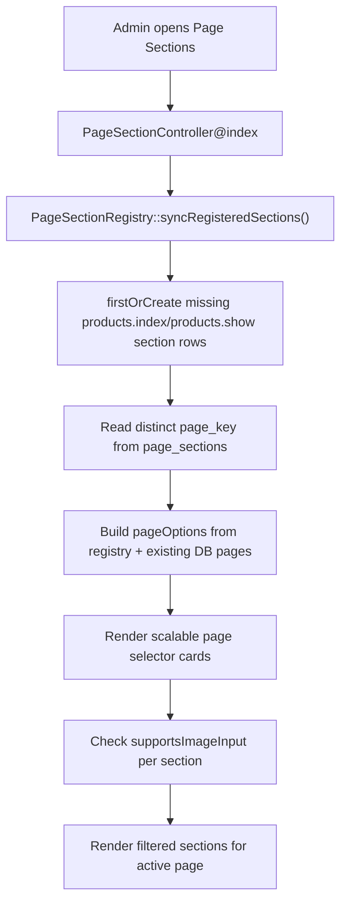

# Page Sections Product Page Sync

Branch: `feature/page-sections-page-management`

## Scope

Dokumentasi ini mencatat step lanjutan Page Sections Page Management untuk mendaftarkan dan menampilkan page yang sudah memiliki `page_key`, khususnya:

- `products.index`
- `products.show`

Perubahan ini fokus pada sinkronisasi admin Page Sections dan mapping frontend. Tidak ada perubahan database schema.

Catatan integrasi:

- Branch ini juga mengintegrasikan ulang hasil UI terakhir dari:
  - `feature/product-page-ui-refresh`
  - `feature/product-detail-ui-refresh`
- Ini dilakukan karena branch Page Sections sebelumnya belum memuat dua refresh UI tersebut, sehingga tampilan frontend product listing/detail terlihat kembali ke versi lama.
- Setelah integrasi, mapping `page_key` dan `section_key` dipasang/ditahan pada markup product UI terbaru.

## Tujuan

- Page product listing dan product detail muncul otomatis di admin dashboard `Page Sections`.
- Admin UI lebih scalable ketika jumlah page bertambah.
- Frontend product listing/detail memiliki `data-page-key`, `id`, dan `data-section-key` yang konsisten.
- Database `page_sections` memiliki row default untuk product pages tanpa harus input manual satu per satu.

## File Terkait

### Registry

- `app/Support/PageSectionRegistry.php`

Fungsi:

- Mendefinisikan daftar page terdaftar.
- Mendefinisikan section default untuk `products.index` dan `products.show`.
- Sync missing section rows ke table `page_sections`.
- Menyediakan metadata page untuk UI admin.
- Menyediakan `supportsImageInput()` untuk menentukan apakah section perlu menampilkan counter media atau badge `No image input`.

### Admin Controller

- `app/Http/Controllers/Admin/PageSectionController.php`

Perubahan:

- Memanggil `PageSectionRegistry::syncRegisteredSections()` saat admin membuka index Page Sections.
- Menggabungkan urutan section dari `HomepageSectionMedia` dan `PageSectionRegistry`.
- Mengirim `pageOptions` ke view admin.

### Admin View

- `resources/views/backend/page-sections/index.blade.php`

Perubahan:

- Page selector dibuat sebagai horizontal card list.
- Setiap page menampilkan:
  - Group
  - Label
  - Description
  - Page key
  - Active state
- Section table membedakan image support per section:
  - Section dengan media slot, legacy image, atau gallery menampilkan counter `x / 10 media item(s)`.
  - Section tanpa image input menampilkan badge `No image input`.
  - Ini mencegah admin mengira section content/control seperti product summary, booking form, filter modal, atau sort modal masih butuh upload image.

UI ini lebih scalable karena page bertambah tetap masuk ke horizontal scroll, bukan menambah tinggi halaman terlalu panjang.

### Frontend Product Listing

- `resources/views/frontend/products/index.blade.php`
- `resources/views/frontend/products/partials/card.blade.php`
- `resources/css/frontend-products.css`
- `resources/css/frontend-theme.css`
- `docs/Product/Product_Page_UI/product-page-ui-refresh.md`

Mapping:

- Page key: `products.index`
- Sections:
  - `products.index.hero`
  - `products.index.catalog`
  - `products.index.filter_modal`
  - `products.index.sort_modal`

### Frontend Product Detail

- `resources/views/frontend/products/show.blade.php`
- `resources/css/frontend-products.css`
- `docs/Product/Product_Detail_UI/product-detail-ui-refresh.md`

Mapping:

- Page key: `products.show`
- Sections:
  - `products.show.hero`
  - `products.show.gallery`
  - `products.show.summary`
  - `products.show.content`
  - `products.show.overview`
  - `products.show.features`
  - `products.show.itinerary`
  - `products.show.notes`
  - `products.show.faq`
  - `products.show.booking`

### Tests

- `tests/Feature/Admin/PageSectionMediaSlotTest.php`
  - Memastikan product pages ter-sync otomatis ke admin Page Sections.

- `tests/Feature/Frontend/ProductPageSectionKeyTest.php`
  - Memastikan product listing dan product detail render page key/section key di frontend.

- `tests/Feature/Frontend/ProductIndexUiTest.php`
  - Memastikan UI product listing refresh tetap render dengan page/section key.

- `tests/Feature/Frontend/ProductDetailBookingFormTest.php`
  - Memastikan UI product detail refresh, gallery, dan booking form tetap render dengan page/section key.

## Registry Structure

`PageSectionRegistry::pages()` menyimpan metadata page:

```php
'products.index' => [
    'label' => 'Product Listing',
    'description' => 'Product catalog hero, listing area, and filter/sort modal sections.',
    'group' => 'Product',
    'order' => 10,
],
```

`PageSectionRegistry::sections()` menyimpan default section rows:

```php
'products.index' => [
    [
        'section_key' => 'products.index.hero',
        'label' => 'Product Listing Hero',
        'title' => 'Explore Tours, Taxi & Activities in Bintan',
        'description' => 'Catalog hero section above the product listing.',
        'sort_order' => 0,
    ],
],
```

## Sync Flow



## Database

Tidak ada migration baru.

Integrasi product UI refresh juga tidak menambah schema database baru. Data product listing/detail tetap memakai table existing product, images, prices, category, destination, dan feature relations.

Table yang dipakai:

### `page_sections`

Field utama:

- `page_key`
- `section_key`
- `label`
- `title`
- `description`
- `is_active`
- `sort_order`

Unique constraint existing:

```php
unique(['page_key', 'section_key'])
```

Sync menggunakan `firstOrCreate`, sehingga tidak overwrite perubahan admin pada row yang sudah ada.

## Page Keys

Current registered frontend pages:

- `home`
- `products.index`
- `products.show`

Jika nanti ada page baru:

1. Tambahkan page metadata di `PageSectionRegistry::pages()`.
2. Tambahkan section default di `PageSectionRegistry::sections()`.
3. Tambahkan `data-page-key` di root frontend page.
4. Tambahkan `id` dan `data-section-key` pada section frontend.
5. Tambahkan test frontend untuk page key/section key.

## Section Keys

### Product Listing

| Section ID | Section Key | Fungsi |
| --- | --- | --- |
| `products-index-hero` | `products.index.hero` | Hero catalog product listing. |
| `products-index-catalog` | `products.index.catalog` | Product grid/listing area. |
| `products-index-filter-modal` | `products.index.filter_modal` | Filter modal. |
| `products-index-sort-modal` | `products.index.sort_modal` | Sort modal. |

### Product Detail

| Section ID | Section Key | Fungsi |
| --- | --- | --- |
| `products-show-hero` | `products.show.hero` | Top wrapper product detail. |
| `products-show-gallery` | `products.show.gallery` | Product detail gallery. |
| `products-show-summary` | `products.show.summary` | Product summary and chat CTA. |
| `products-show-content` | `products.show.content` | Lower content wrapper. |
| `products-show-overview` | `products.show.overview` | Product overview. |
| `products-show-features` | `products.show.features` | Product features. |
| `products-show-itinerary` | `products.show.itinerary` | Product itinerary. |
| `products-show-notes` | `products.show.notes` | Product notes. |
| `products-show-faq` | `products.show.faq` | Product FAQ. |
| `products-show-booking` | `products.show.booking` | Booking information area. |

## UI Notes

- Page selector tidak lagi sekadar tab kecil.
- Page selector memakai card horizontal agar:
  - page key tetap terlihat,
  - page label lebih manusiawi,
  - description membantu admin memahami page,
  - scalable saat page bertambah.
- Media status di kolom section key tidak lagi selalu memakai `0 / 10`.
- Counter media hanya muncul untuk section yang memang memiliki image input.
- Section yang tidak menerima image memakai badge `No image input`, sehingga admin paham section tersebut hanya untuk struktur/content/control.

## Product UI Integration Notes

Branch ini sekarang memakai product frontend terbaru:

- Product listing:
  - hero background full seperti homepage,
  - card visual overlay,
  - title sebagai link detail,
  - action icon image/video,
  - in-page media modal.
- Product detail:
  - offset terhadap floating header,
  - gallery utama dengan previous/next,
  - thumbnail maksimal 4,
  - booking information form,
  - WhatsApp message dibentuk dari input booking.

Hal penting untuk Page Sections:

- Page Sections tidak mengganti data product entity.
- Page Sections hanya memberi registry/mapping untuk area static atau structural section.
- Product cards, product detail content, gallery product, price, booking data, dan add-ons tetap berasal dari data product existing.
- Mapping `products.index.*` dan `products.show.*` harus dipasang pada UI final, bukan pada markup versi lama.

## Validation

Command yang perlu dijalankan:

```bash
php artisan test tests\Feature\Admin\PageSectionMediaSlotTest.php
php artisan test tests\Feature\Frontend\ProductPageSectionKeyTest.php
npm.cmd run build
php artisan test
```

## Catatan

- Branch ini mendaftarkan product page ke Page Sections admin.
- Branch ini belum membuat full page builder.
- Product content masih berasal dari product entity/table existing.
- Page Sections di step ini menjadi mapping/editor shell untuk section, bukan pengganti product data.
